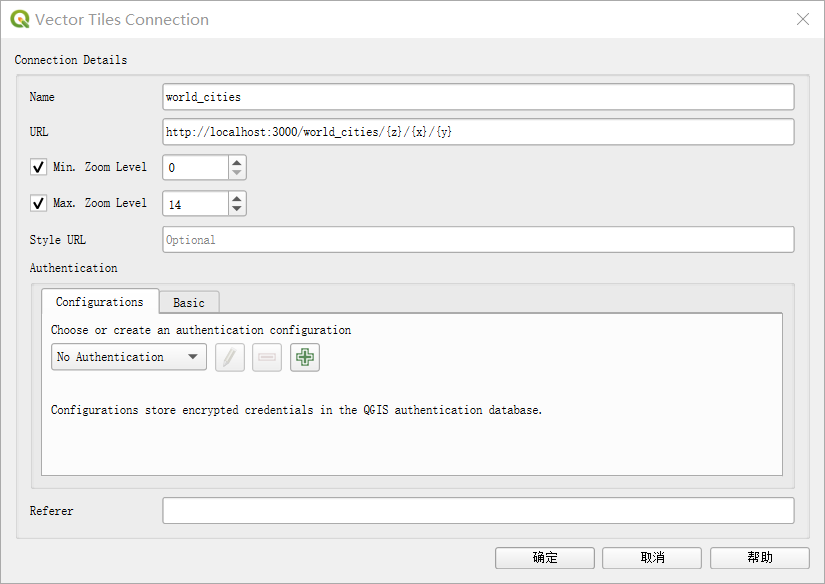

## With windows

### Download Martin And Data

1. Download the demo `world_cities.mbtiles
` , file from the [martin repo](https://github.com/maplibre/martin/blob/main/tests/fixtures/mbtiles/world_cities.mbtiles).

2. Download the latest version of Martin binary from the [release page](https://github.com/maplibre/martin/releases), for windows it's the `martin-x86_64-pc-windows-msvc.zip
` file.

3. Extract `martin-x86_64-pc-windows-msvc.zip`, and place the `martin.exe` and the `world_cities.mbtiles` in the same directory.

### Run Martin

1. Open the command prompt and navigate to the directory where `martin.exe` and `world_cities.mbtiles` are located.

2. Run the following command to start Martin with the demo data:

```shell
./martin.exe --help
./martin.exe .\world_citie.mbtiles
```

### View The Map

#### With QGIS

1. Open QGIS and add a new `Vector Tiles` with the following URL:`http://127.0.0.1:3000/world_cities`.



2. In the browser of QGIS, right click on the new added martin layer and click on `Add Layer to Project`, the map would be shown on the QGIS.


